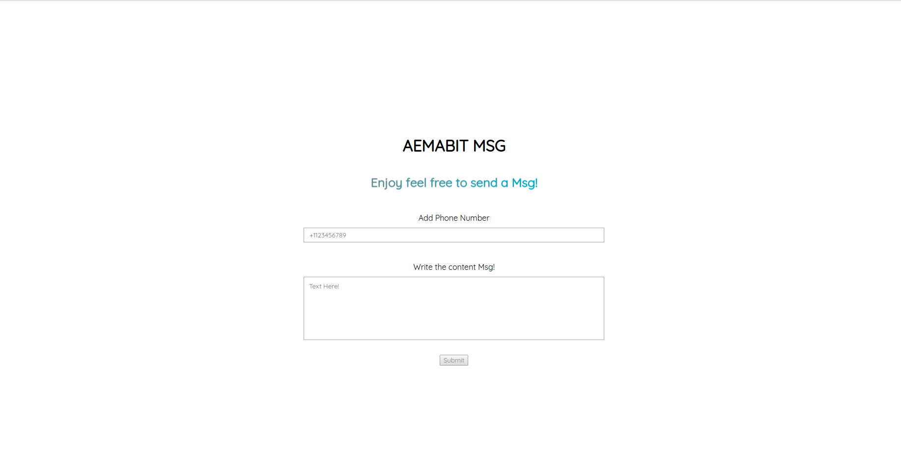

# SMS TWILIO

## Description
React application with Express server.

## Objetives
* Create like a express api to post msg from the frontend in React.
* Use Twilio to send msg.

## Using this project

* Clone the project, change into the directory and install the dependencies.

* yarn install
  
* cd client && yarn install

* Create a .env file for environment variables in your server.
  * To create an account in  Twilio use this link www.twilio.com/referral/hlwoqu

## To make it run
yarn start from project root
yarn start inside of /client
